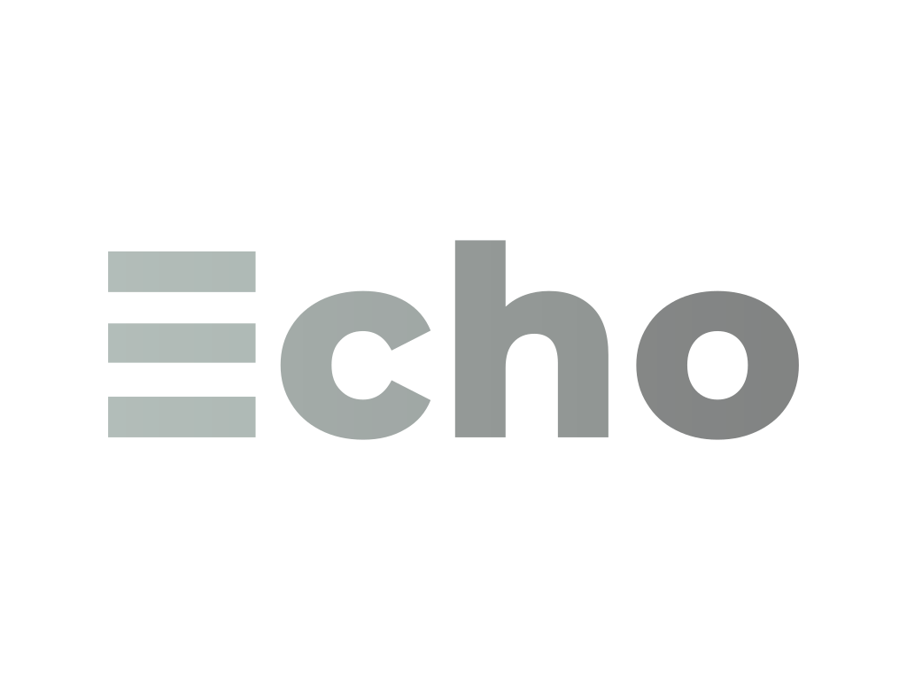
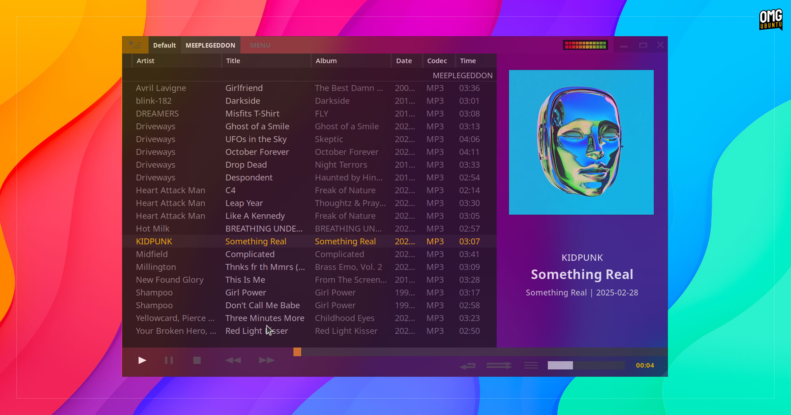

# Echo

A polished, minimal desktop application template — branded as Echo (aka Echomp for uniqueness).

## Key Features

- **Modern Stack:** Qt6 + QML UI with CMake build system.
- **Modular:** Clear separation between C++ logic and QML presentation.
- **Assets Included:** Project logo and demo screenshot for quick previews.

## Demo



## Build & Run

Quick commands (Linux):

```bash
cmake -S . -B build
cmake --build build --config Release
./build/echomp  # or the produced executable in build/
```
## Contributing

- Fork the repository, create a feature branch, and submit a pull request with clear description and minimal scope.

## License

This project does not include a license file by default. Add an appropriate `LICENSE` if you intend to publish or redistribute.

## Contact

For questions or partnership, open an issue or contact the maintainers via the repository issue tracker.
